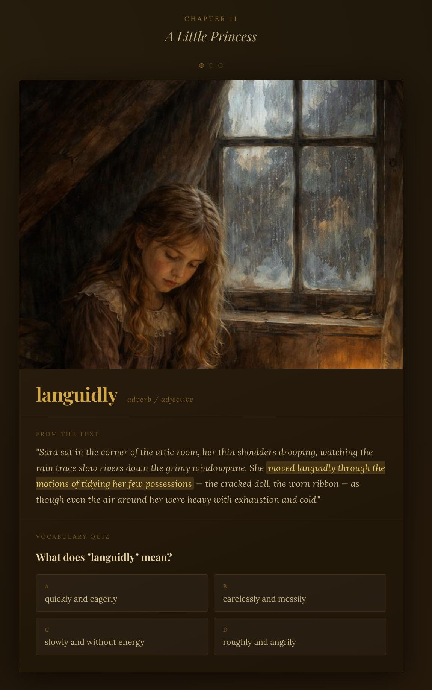

# Vocabulary Quest

### 1. What is this?

A vocabulary learning game for middle-grade readers (ages 10–14), built around books they are actively reading. Upload any EPUB or TXT book, pick a chapter, and the app finds the most valuable vocabulary words in it — SAT-level words that appear in rich, meaningful context. Each word is presented in its original passage so the reader can connect the definition to the story they love.

The game has two rounds: **word → meaning** (guess the definition from context, with hints if you're stuck), then **fill in the blank** (given the definition, find the word in the passage). A Story Bible ensures that AI-generated illustrations stay visually consistent across sessions — same characters, same settings, same painterly Victorian aesthetic throughout.

---

### 2. What does it look like?



*A vocabulary card for the word "languidly" from A Little Princess, with a Midjourney illustration, the original passage with the word highlighted, and four multiple-choice options.*

---

### 3. How do I run it?

**Quickest — no install needed:**

Open the live artifact directly in Claude.ai. Word suggestion, quiz generation, and the Story Bible all work immediately. Images can be added via the offline workflow below.

**In GitHub Codespaces (recommended for image generation):**

1. Click **Code → Codespaces → Create codespace on main**
2. Wait ~2 minutes for the environment to build
3. Add your API keys:
   ```bash
   cp .env.example .env
   # Edit .env with your keys
   ```
4. Start the app:
   ```bash
   npm run dev
   ```
5. Click the forwarded port popup — Vocabulary Quest opens in your browser

When running locally, images are generated automatically via the Gemini API — no manual steps needed.

**Locally on your machine:**

```bash
git clone https://github.com/YOUR_USERNAME/vocab-quest.git
cd vocab-quest
npm install
cp .env.example .env
# Edit .env with your keys
npm run dev
```

---

### 4. How do I configure it?

| Variable | Where to get it | Required for |
|----------|----------------|--------------|
| `VITE_ANTHROPIC_API_KEY` | [console.anthropic.com](https://console.anthropic.com) → API Keys | Word suggestions, quiz generation, Story Bible |
| `VITE_GEMINI_API_KEY` | [aistudio.google.com](https://aistudio.google.com) → API Keys | Live image generation (local only) |

Copy `.env.example` to `.env` and fill in the values. The `.env` file is gitignored and will never be committed.

**Note:** When running inside the Claude.ai artifact, no configuration is needed — the artifact uses injected keys tied to your Claude Pro session. Images in the artifact are loaded via an offline tarball workflow (see below).

**Offline image generation (Claude.ai artifact):**

Since the artifact sandbox blocks direct calls to external APIs, images are generated separately using the included Docker script:

```bash
# Build the image generator once
docker build -t vocab-image-gen .

# Export words.json from the app's word selection screen, then run:
docker run --rm \
  -v "$(pwd):/data" \
  vocab-image-gen \
  --key YOUR_GEMINI_API_KEY \
  --input words.json \
  --output vocab-images.tar.gz
```

Upload `vocab-images.tar.gz` in the app before clicking **Generate Game**.

---

### 5. How does it work?

The app is a single React component (`src/App.jsx`) with eight sequential phases:

**Upload → Story Bible → Chapter Select → Word Suggestion → Asset Generation → Game → Results**

- **EPUB/TXT parsing** — JSZip extracts chapter text client-side; no server needed
- **Story Bible** — Claude reads up to 60,000 characters of the book and extracts character appearances and setting descriptions. Cached by SHA-256 hash of the book text — generated once, loaded instantly on return visits
- **Word suggestion** — Claude identifies up to 20 SAT-level words per chapter that appear verbatim in the text, with character position verified client-side. Also cached per chapter
- **Quiz generation** — A single Claude API call generates all quiz options and hints for the selected words at once
- **Image prompts** — Built from the original passage + matching Story Bible character/setting descriptions + book-wide style constants, ensuring visual consistency across all illustrations
- **Two-round game** — Round 1: word → meaning (keep trying with hints until correct). Round 2: fill in the blank (definition given, choose the correct word)
- **Results** — Separate scores for each round, showing first-try vs. with-a-hint performance

**Tech stack:** React 18, Vite, Anthropic Claude API, Google Gemini image API, JSZip, pako (TAR parsing)
